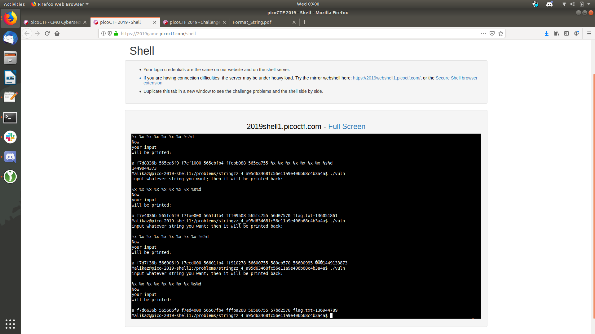

# Stringzz Pico 2019 

## Open Source Data

[Write up on formate string](http://www.cis.syr.edu/~wedu/Teaching/cis643/LectureNotes_New/Format_String.pdf)

Can see the flag I think in memory just need to get it out some how

## Solve