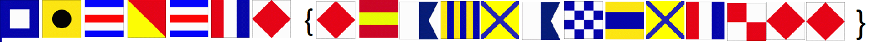

# Flags Pico 2019
```
What do the flags mean
```


## Open Soruce Data


Reconised the flags as International Flag Code single sign flags and found image on google to decode it. [img](https://www.maritime-sign-solutions.com/international-flag-code-single-sign-flags-35946.html)


## Solve

use the image to decode the flags to the picoCTF flag.